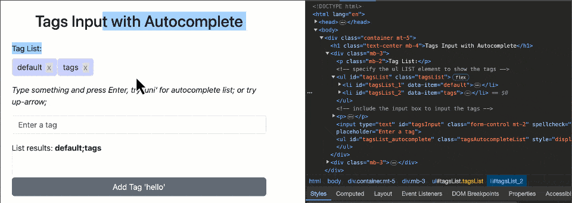

# input2tags
## Version 3.02
## Supercedes js-input2tags (v2.01)

**Check the CodePen.io [basic example](https://codepen.io/mindflowgo/pen/PwYNQVe); [autocomplete example](https://codepen.io/mindflowgo/pen/MYgyVgg).**

*Project objective: simple but powerful vanilla ES6 javascript (code: 350 lines) input tag generator for any input fields; with auto-completion lists.*

Based off the inspiration work of [github.com/rk4bir/simple-tags-input](https://github.com/rk4bir/simple-tags-input); using his idea and CSS but then rewritten for ES6 and more features. Can record special keys (Meta, Alt, Tab, MouseLeft, VolumeUp, etc) as key presses.

This project is mobile-friendly: but you may want to prevent scrolling of screen depending on your needs.

## Demo
[Demos & Instructions](https://mindflowgo.github.io/input2tags/)

Video illustrations:




## Options
*Only required tags are inputId*
- **allowDelete**: allow the [x] deleting of tags (default true)
- **allowDuplicates**: allow duplicate tags (default false)
- **allowSpaces**: allow spaces in tags (default false)
- **allowCustomKeys**: enables special character handling (default false)
- **autocomplete**: array of auto-complete options
- **initialTags**: array of initial tags to display
- **targetEl**: target list element (if UL) or parent for the created list element
- **onAdd**: a function called before adding the tag text (returns text or modified version)
- **onDelete**: a function called before deleting a tag (returns true if allowed, false otherwise)
- **onInput**: a function called after new user input received
- **onChange**: a function called after change to tags (new tag added, re-arranged, deleted tag)

## Methods
*With a valid Input2Tags() instance you have these methods:*
- **getTags()**: get the list of tags created
- **setTags([])**: set the list of tags
- **addTag(tag)**: add a new tag to input tags instance
- **deleteTag(index)**: remove a tag, the index of it's placement
- **showAutocomplete(query)**: showes autoComplete with matches for the query
- **hideAutocomplete()**
- **destroy()**: remove the instance

## Usage
There are 3 steps to using it
1. Include the CSS & JS files (importing it into a script type=module)
2. Have an empty list (UL) and an input box (INPUT)
3. Run the function: const inputTags = new Input2Tags({ inputId: "tagsInput", listId: "tagsList" });

That's it!

### BASIC Example
> Check the [CodePen.io example](https://codepen.io/mindflowgo/pen/PwYNQVe).

#### Step 1 - Include Files (change path to match where they are)
```html
    <head>
        <link rel="stylesheet" href="https://unpkg.com/input2tags@latest/style.css">
    </head>

    <script type="module">
    import Input2Tags from "https://unpkg.com/input2tags@latest"
    </script>
```

#### Step 2 - Insert needed HTML into your code
```html
<div>
    <ul id="tagsList"></ul>
    
    <input type="text" id="tagsInput" spellcheck="false" placeholder="Enter a tag" />
</div>
```

#### Step 3 - Run Javascript (to initialize INPUT field)
```javascript
    const inputTags = new Input2Tags({ inputId: "tagsInput", listId: "tagsList" });
```

**Quick example html**
```html
<!DOCTYPE html>
<html lang="en">
<head>
    <meta charset="UTF-8">
    <meta http-equiv="X-UA-Compatible" content="IE=edge">
    <meta name="viewport" content="width=device-width, initial-scale=1.0">
    <!-- Bootstrap 5 not used by Input Tags -->
    <link href="https://cdn.jsdelivr.net/npm/bootstrap@5.3.3/dist/css/bootstrap.min.css" rel="stylesheet" integrity="sha384-QWTKZyjpPEjISv5WaRU9OFeRpok6YctnYmDr5pNlyT2bRjXh0JMhjY6hW+ALEwIH" crossorigin="anonymous">
    
    <!-- Only CSS used by Input2Tags -->
    <link rel="stylesheet" href="https://unpkg.com/input2tags@latest/style.css">
</head>

<body>
    <div class="container mt-5">
        <h1 class="text-center mb-4">Tags Input</h1>
            
        <div class="mb-3">
            <p class="mb-2">Tag List:</p>
            <!-- specify the ul LIST element to show the tags -->
            <ul id="myTagList"><li><strong>List:</strong></li></ul>
            <!-- include the input box to input the tags -->
             <p><i>Type something and press Enter</i></p>
            <input type="text" id="tagsInput" class="form-control mt-2" spellcheck="false" placeholder="Enter a tag" />
        </div>
            
        <div class="mb-3">
            <p class="mb-2">List results: <strong><span id="tagsData"></span></strong></p>
            <div class="mt-5 d-grid gap-2 d-md-flex justify-content-md-start">
                <button class="btn btn-secondary ms-md-2" onClick="btnAddTag('hello')">Add Tag 'hello'</button>
            </div>
        </div>
    </div>

     <!--Simple tags input implementation-->
     <script type="module">
        import Input2Tags from "https://unpkg.com/input2tags@latest"

        const inputEl = document.getElementById('tagsInput');
        const inputTags = new Input2Tags(inputEl, {
            autocomplete: ['apple', 'banana', 'cherry'],
            // initialTags: ['one','two','three'], // pre-populate (1)
            targetEl: document.getElementById('myTagList'), // pre-populate (2)
            onChange: (tags) => document.getElementById('tagsData').innerHTML = tags?.join(',') || ''
        });

        // show initial tags by adding something
        setTimeout( ()=>inputTags.addTag('Auto-Add'), 100)

        // export module functions for DOM
        window.btnAddTag = (tag) => inputTags.addTag(tag);
     </script>
</body>
</html>        
```

### AutoComplete Example
> Check the [CodePen.io example](https://codepen.io/mindflowgo/pen/MYgyVgg).

#### Step 1 - Include Files (change path to match where they are)
```html
    <head>
        <link rel="stylesheet" href="https://unpkg.com/input2tags@latest/style.css">
    </head>

    <script type="module">
    import Input2Tags from "https://unpkg.com/input2tags@latest"
    </script>
```

#### Step 2 - Insert needed HTML into your code
Really just having an input box to enter tags is all that is needed. The package can use
an existing list (UL) otherwise it will create one and pre-pend above the INPUT box.
```html
<div>
    <input type="text" id="tagsInput" spellcheck="false" placeholder="Enter a tag" />

    <button onClick="btnAddTag('hello')">Add Tag 'hello'</button>
</div>
```

#### Step 3 - Run Javascript (to initialize INPUT field)
```javascript
    const inputEl = document.getElementById('tagsInput');
    const inputTags = new Input2Tags(inputEl, {
        autocomplete: ['apple', 'banana', 'cherry'],
        initialTags: ['one','two','three'], // pre-populate (1)
        // targetEl: document.getElementById('myTagList'), // pre-populate (2)
        // onChange: (tags) => document.getElementById('tagsData').innerHTML = tags?.join(',') || ''
    });

    // export module functions for DOM access if needed
    window.inputTags = inputTags;
```

### Advanced Ideas
You can use the 4 hooks to limit characters allow in inputs, prevent certain tags from being created, or others from being deleted (with these hooks: onInput, onAdd, onDelete)

```javascript
    const inputEl = document.getElementById('tagsInput');
    const inputTags = new Input2Tags(inputEl, {
        targetEl: document.getElementById('myList'),
        autocomplete: ['apple', 'banana', 'cherry', 'pear', 'pineapple'],
        // allowCustomKeys: true,
        // onInput: (value,e) => customKeyHandling(value,e),
        onInput,
        onAdd,
        onDelete,
        onChange: (tags) => document.getElementById('tagsOutput').value = tags?.join(',') || '',
        });
```
- *AutoComplete*: Triggering display of autocomplete: see example/advanced.html "Show AutoComplete" button.
```html
    <button onClick="showList('apple')">Show AutoComplete List</button>
```
```javascript
    window.showList = (search) => inputTags.showAutocomplete(search);
```

####
If you modify the javascript in src/inputtags.js, you can build it with `npm run build` for distribution.

Before forking and spreading another version, please contact the author with a PR if you have improvements 
you would like. I'd be happy to integrate improvements.